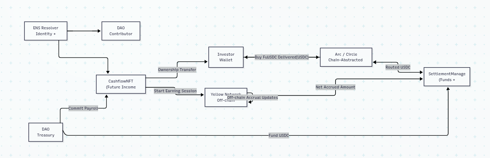

THIS DOC CONTAINS 2 DIFFERENT SOURCES OF TRUTH OF THE SAME PROJECT AND STILL NOT FULLY REVIEWED. MAY HAVE CONCEPTUALLY WRONG OR/AND CONTRADITORY TEXT

# Scope

## For hackathon
- Treating _future, whether predictable or impredicable cashflows_ as collateral for crypto loans or tokenized bonds for investors(RWA asset)
- Can be sold/used by companies, like uber, ifood, etc (Neo bank for those companies, they create wallets for payment and could give payroll loans to their drivers, or let the drivers sell it for investors)
- cashflow can be already onchain and enforceable by a smart contract or off-chain, in this case the onboarded client is the cash flow provider
- list tokenized cashflows like in a marketplace
- use a hardcoded discount as interest model

## What to do in the future
- Direct integration with Uber, iFood, Airbnb, etc.
- credit scoring
- Full marketplace
- Legal wrappers for RWAs  
- Fractional trenching  
- Dynamic repricing

## Hackathon framing(Need to improve)

 Future cashflow rights locked by provider or receiver > Investor buys the stream >   Payments flow directly to investor. No “debt”, it’s a purchase. 
 Optimal for marketplace. 
 We could pool the tokenized flows and ease interest overtime while the rights are not sold. 
 Dividends is the easiest example right now, using tokenized stocks.

## MVP Clients

- Web3 payroll

- DAO contributors

- Content creators

- Bounties / grants

- Tokenzied stock investors -> dividends

## Examples of related primitives:
- **Sablier / Superfluid** – streaming income
- **Alchemix** – borrowing against future yield
- **Notional / Pendle** – time-based cashflow separation
- **Goldfinch / Maple** – cashflow-based credit (but offchain risk)

## Differentiation on our Value Proposition
- cashflow-native credit.
- The **stream itself is the collateral** / **Asset** (Rights to stream)
- Automatic repayment
- possible to lock some kinds of cash flows

## Sponsors targeting

1. 🟢 **Yellow Network (HIGH PRIORITY)** 
2. 🟢 **Arc / Circle (HIGH PRIORITY)**
3. 🟡 **ENS**
  
###  Yellow Network prize and description
Use the Yellow SDK and Nitrolite protocol to build a mini-app or feature that showcases instant, session-based transactions - all happening off-chain and settling on-chain when needed. 💥 How to participate - Integrate the Yellow SDK, connect to the Nitrolite test environment and create a wallet session. - Implement off-chain logic: simulate sending or spending assets instantly between users or in-app actions. - Show on-chain settlement: finalize balances through smart-contract calls when users end their session. 🛍️ Example App Ideas - Trading apps - Prediction market apps - Tipping System: users send 0.01 USDC per like, emoji, or message without gas or delay. - Pay-Per-Use App: charge users per API call, minute, or read action - settle once at the end of session. - Cross-App Wallet: one balance shared across multiple dApps (browser plugin, Telegram mini-app, etc.). 💎 Why Build on Yellow - Gas-free & instant: off-chain state channels = Web2 speed, Web3 security. - Session-based logic: define allowances for in-game or in-app use. - Multi-chain ready: works with all EVM chains; Solana support coming soon.
### Qualification Requirements

✅ Qualification Requirements - to qualify for the Yellow Network Prize, your project must: - Use the Yellow SDK / Nitrolite protocol in your submission. - Demonstrate off-chain transaction logic — e.g., instant payments, session-based spending, or settlement finalized via smart contracts. - Deploy or simulate a working prototype showing how Yellow improves transaction speed, UX, or efficiency. - Include a 2–3 minute demo video showing your integration and user flow. - Submit your project under the “Yellow Network” prize track on ETHGlobal and include a repo link. 🏆 Judging Criteria Projects will be evaluated based on: - Problem & Solution: clarity of the problem addressed and creativity of the solution. - Yellow SDK Integration: depth and impact of integration with Yellow technology. - Business Model: clarity and sustainability of the project’s value or revenue model. - Presentation: ability to communicate the idea clearly and persuasively. - Team Potential: team’s skill, passion, and commitment to continue post-hackathon.

### Arc / Circle prizes and description

#### Best Chain Abstracted USDC Apps Using Arc as a Liquidity Hub

Build apps that treat multiple chains as one liquidity surface, using Arc to move USDC wherever it’s needed. Projects should demonstrate how capital can be sourced, routed, and settled across chains without fragmenting user experience. What we’re looking for: -Crosschain payments, credit, or treasury systems -Applications that are not locked to a single chain -Seamless user experience despite crosschain complexity

**Qualification **Requirements**

CIRCLE TOOLS REQUIRED: Arc, Circle Gateway, USDC, Circle Wallets Qualification Requirements Submissions will be evaluated based on the following parameters. Please be clear what bounty you are submitting for as a part of your submission! * Functional MVP and diagram: Projects must demonstrate a working frontend and backend plus an architecture diagram. * Product feedback - clear and actionable feedback will heavily influence the judgement of your submission * Video demonstration + presentation: Succinctly outlining the project's core functions and its effective use of Circle's Developer tools/tech is required, supported by detailed documentation. * Link to GitHub/Replit repo

#### Build Global Payouts and Treasury Systems with USDC on Arc ⸺ $2,500

Build payout or treasury systems that move USDC globally, automatically, and reliably. Projects should show how onchain infrastructure can support real-world financial operations like payroll, revenue distribution, or fund settlements. What we’re looking for: -Automated or agent-driven payout logic -Multi-recipient, multi-chain settlement -Treasury systems backed by RWAs -Policy-based or condition-based payouts

**Qualification Requirements**

CIRCLE TOOLS REQUIRED: Arc, Circle Gateway, Circle Wallets, Bridge Kit Submissions will be evaluated based on the following parameters. Please be clear what bounty you are submitting for as a part of your submission! * Functional MVP and diagram: Projects must demonstrate a working frontend and backend plus an architecture diagram. * Product feedback - clear and actionable feedback will heavily influence the judgement of your submission * Video demonstration + presentation: Succinctly outlining the project's core functions and its effective use of Circle's Developer tools/tech is required, supported by detailed documentation. * Link to GitHub/Replit repo

#### Best Agentic Commerce App Powered by Real-World Assets on Arc ⸺ $2,500

Build applications where autonomous agents use real-world assets as productive capital to power onchain commerce. Projects should showcase agents that can make decisions, execute transactions, and manage risk, all settled in USDC. What we’re looking for: -AI agents that borrow, repay, or rebalance against RWA collateral -Autonomous spending, payments, or treasury management -USDC-denominated credit or cash flow backed by RWAs -Clear agent decision logic tied to oracle or market signals

**Qualification Requirements**

REQUIRED TOOLS: Arc, USDC, Circle Wallets, Circle Contracts, Stork Qualification Requirements Submissions will be evaluated based on the following parameters. Please be clear what bounty you are submitting for as a part of your submission! * Functional MVP and diagram: Projects must demonstrate a working frontend and backend plus an architecture diagram. * Product feedback - clear and actionable feedback will heavily influence the judgement of your submission * Video demonstration + presentation: Succinctly outlining the project's core functions and its effective use of Circle's Developer tools/tech is required, supported by detailed documentation. * Link to GitHub/Replit repo

### ENS 

#### 🎉 Integrate ENS ⸺ $3,500

Split evenly between all qualifying projects

Any type of ENS integration is eligible for this pool prize, split evenly among all eligible projects. Get creative!

**Qualification Requirements**

You need to write some code specifically for ENS, even if it's just a couple wagmi hooks. Simply using Rainbowkit does not count. Your demo must be functional and not contain hard-coded values. Upon submission, your project showcase must have a video recording or link to a live demo (ideally both) and the code needs to be open source and accessible on Github or a similar platform.

#### 🥇 Most creative use of ENS for DeFi ⸺ $1,500

ENS is often thought of as simple name <> address mapping, but really its much more flexible! Names can store arbitrary data via text records, decentralized websites via content hash and more. This prize goes to the most creative application of ENS in DeFi. This could be some sort of swap preferences stored in text records, DEX contracts that are named via ENS, decentralized interfaces or anything else.

**Qualification Requirements**

It should be obvious how ENS improves your product and is not just implemented as an afterthought. Your demo must be functional and not just include hard-coded values. Upon submission, your project showcase must have a video recording or link to a live demo (ideally both) and the code needs to be open source and accessible on Github or a similar platform.

## One-Sentence Framing 

> We let people sell future income — like DAO payroll or dividends—upfront, with income accruing instantly off-chain and settling cross-chain in USDC.

## Happy Path A — DAO Contributor / Web3 Payroll (Primary Demo)

### Step 1 — Contributor Identity & Payroll Commitment (ENS)

**Flow**

- Contributor logs in as `alice.eth`
    
- DAO commits:
    
    - 2,000 USDC over 60 days
        
- Protocol mints:
    
    - **Payroll Cashflow NFT**
        

**ENS Usage**

- ENS text records on `alice.eth`:
    
    - `income:type=dao-payroll`
        
    - `income:dao=exampleDAO`
        
    - `income:currency=USDC`
        

**Judge signal**

- ENS is not cosmetic
    
- Identity + income are linked
    

---

### Step 2 — Upfront Liquidity via Sale (Arc / Circle)

**Flow**

- Alice sells the payroll stream:
    
    - Sells future 2,000 USDC
        
    - Receives 1,750 USDC upfront
        
- Investor pays from another chain
    
- Arc routes USDC seamlessly
    

**What to show**

- “Paid from Optimism → settled on Base”
    
- Single button UX
    

---

### Step 3 — Yellow Earning Session (Key Technical Moment)

**Concept**  
Payroll is earned continuously → perfect for Yellow sessions.

**Flow**

- DAO opens a **Yellow session** for Alice’s payroll.
    
- Each “work day”:
    
    - Off-chain balance updates
        
    - Investor’s claim increases
        
- UI shows:
    
    - “Payroll earned so far: 640 / 2,000 USDC”
        

**Critical framing**

> The future payroll NFT is being _consumed_ inside a Yellow session.

---

### Step 4 — Settlement

- Session ends
    
- Yellow settles on-chain
    
- Arc routes USDC to investor
    
- Alice’s obligation is fulfilled automatically
    

---

## Happy Path B — Tokenized Stock Dividend Investor (Secondary Demo)

This is a **shorter, conceptual but still working** demo.

---

### Step 1 — Dividend Source Lock

**Flow**

- Investor holds:
    
    - Tokenized stock (ERC-20 or ERC-721 mock)
        
- Locks stock into protocol
    
- Protocol issues:
    
    - **Dividend Cashflow NFT**
        

**Key distinction**

- Asset locked ≠ sold
    
- Only _dividend rights_ are sold
    

---

### Step 2 — Sell Dividend Stream Upfront

**Flow**

- Expected dividends:
    
    - 500 USDC over 12 months
        
- Investor sells dividend rights for:
    
    - 420 USDC upfront
        
- Buyer receives future dividends
    

**ENS usage**

- ENS name:
    
    - `dividends.alice.eth`
        
- Text records:
    
    - `income:type=equity-dividend`
        
    - `income:ticker=MOCK`
        
    - `income:frequency=quarterly`
        

---

### Step 3 — Yellow Dividend Sessions

**This is the clever merge**

- Each dividend period = **new Yellow session**
    
- When dividends are announced:
    
    - Off-chain accrual begins
        
    - Instant balance updates
        
- At end of quarter:
    
    - Session settles on-chain
        
    - Buyer receives USDC
        

**Why this is strong**

- Dividends are _episodic_
    
- Yellow handles uncertainty elegantly

###  Optional: Agentic Layer ight)

add a **simple rule-based agent**:

**Agent logic**

- If remaining duration > 15 days:
    
    - Keep earning
        
- Else:
    
    - Auto-sell remaining cashflow at discount
        

**Why include**

- qualifies for:
    
    - “Agentic Commerce powered by RWAs”
        
- Even if simple, it shows programmability

## Overral system idea

### Smart Contracts

- `CashflowNFT` (ERC-1155)
    
- `SettlementManager`
    
- ENS resolver reads
    

### Off-chain

- Yellow session logic
    
- Accrual simulator

### Infra

- Arc + USDC
    
- Circle Wallets

### Frontend

- Create cashflow
    
- Sell cashflow
    
- Start / tick / end session
    
- ENS resolution


## High-Level Architecture



## CashflowNFT Contract

**Purpose**: Represents the _right to receive a future cashflow_.

### Interface

```solidity
interface ICashflowNFT {
  struct Cashflow {
    address borrower;              // DAO treasury or dividend source
    address settlementManager;  
    uint256 totalAmount;        // e.g. 2000 USDC
    uint256 startTime;
    uint256 endTime;
    address currency;           // USDC
    CashflowType cashflowType;  // PAYROLL | DIVIDEND
  }

  function mintCashflow(
    address recipient,
    Cashflow calldata data
  ) external returns (uint256 tokenId);

  function ownerOf(uint256 tokenId) external view returns (address);
}
```

### Notes

- **NFT = asset**, not debt
    
- Ownership = right to future payments
    
- Works for payroll _and_ dividends

---

## SettlementManager Contract

**Purpose**: Owns funds, tracks accruals, and finalizes settlement.
### Interface

```solidity
interface ISettlementManager {
  function lockFunds(
    uint256 cashflowId,
    uint256 amount
  ) external;

  function recordAccrual(
    uint256 cashflowId,
    uint256 amount
  ) external;

  function settle(
    uint256 cashflowId
  ) external;
}
```

### Responsibilities

- Receives USDC from DAO treasury
    
- Receives accrual proofs from Yellow session
    
- Transfers USDC to current NFT owner
    
---

## Yellow Session Adapter (Off-chain Logic)

**Purpose**: Bridges Yellow off-chain state → on-chain settlement.

### Conceptual Interface

```solidity
interface IYellowAdapter {
  function startSession(uint256 cashflowId) external;

  function submitAccruedAmount(
    uint256 cashflowId,
    uint256 amount
  ) external;

  function closeSession(uint256 cashflowId) external;
}
```

### Notes

- Session logic is **off-chain**
    
- Only final net amounts touch the chain
    
- Matches Yellow's model perfectly
    
---

## ENS Integration

**Purpose**: Human-readable identity + income metadata.

### Reads Only

```solidity
interface IENSResolver {
  function addr(bytes32 node) external view returns (address);
  function text(bytes32 node, string calldata key) external view returns (string memory);
}
```

### Used For

- Resolve `zezinho.eth → address`
    
- Read:
    
    - `income:type`
        
    - `income:currency`
        

No ENS writes required on-chain for MVP.

---

# Arc / Circle (External, no dev need)

**Purpose**: Chain-agnostic USDC routing.

- USDC transfers routed via Arc SDK
    
- SettlementManager only sees **final USDC arrival**
    
- No bridge contracts needed in your repo
    
---

## Event Flow (DAO Payroll – Live Demo)

```
DAO funds SettlementManager
      ↓
CashflowNFT minted to Alice
      ↓
Investor buys NFT (Arc USDC)
      ↓
Yellow session starts
      ↓
Off-chain accrual ticks
      ↓
Yellow submits net accrual
      ↓
SettlementManager settles
```

---

#  Payroll dApp **with credit line** and a new Revenue-Backed Note (RBN) primitive 

*(RBN = tokenized future cashflow / revenue-backed debt instrument)*

---

## Problem

Over-collateralization dominates DeFi. 
Predictable future cash inflows (payroll, subscriptions, protocol fees) remain underfinanced because there’s no simple, on-chain, loan-level instrument that: 
  1. Encodes the receivable 
  2. Exposes underwriting provenance 
  3. Lets capital price that credit directly.

---

## Core thesis

Exactly how traditional banks operate today, employees payment is a predictable cashflow and future income can be priced and traded in the present.

Banks can offer his clients an under-collateralized creidt line based on that future income assesing the risk of default of the client.

While banks can enforce law uppon payment defaults, its not common to require law enforcment. Benefits of a creditworthy account overcome benefits of defaulting.

We can offer a similar service through a Crypto payroll app (with strong incentives to operate as a DAO)

We can implement a **DeFi primitive** that enables **tokenized trading of undercollateralized future cashflows**.

---

## Specific Solution

* Define an on-chain **RBN** that binds: originator, terms, repayment schedule, attestation CID, risk-model version, and status.
* DAO originators underwrite and front advances. Offerning the employees instant creditlines and minting RBNs that can be tradable on-chain.
* Investors buy RBNs using market demmand to adjust yield (the interest of the credit-lines). 
* DAO governance refines underwriting (risk assesment, interest rates, etc)
* Investors are incentivized to participate in the DAO since they seek for higher yield and low default rates
* Payroll dApp = concrete vertical to demo the primitive with on-chain, interceptable cashflows.

---

## Basic economics:

For a single RBN:

* (P) = principal advanced now
* (R) = contractual total repayment (principal + interest + fees)
* (q) = probability of repayment (empirical)
* (D) = recovery on default

Expected RBN value:
```math
\mathbb{E}[\text{RBN}] = q \cdot R + (1 - q) \cdot D
```

Investor price (X) (time-discounted):
```math
X \approx \frac{\hat{q} \cdot R}{(1 + r + \lambda)^T}
```

Feasible trade band for a bank selling to investors:

```math
P < X < \mathbb{E}[\text{RBN}]
```

Surplus split:

* Bank profit = (X - P)
* Investor expected profit = $(\mathbb{E}[\text{RBN}] - X)$

Design levers: advance rate, caps, originator first-loss, R (policy). **q** is learned from outcomes; **R** is the control variable.

---

## Current landscape (closest comparisons)

* **Maple / Goldfinch / Clearpool** — originator credit markets (institutional, opaque).
* **Pendle** — yield tokenization (no default risk).
* **Aave credit delegation** — delegated borrowing, not tokenized receivables.
* **3jane** — money-market yield pooling (not loan-level).
* **Levenue / Loom (whitepaper)** — similar receivable financing ideas.
  **Gap:** none focus on a simple, open, loan-level RBN primitive with DAO governance and payroll demo. Their described implementation is different and is focused on off-chain attestation.

---

## What makes us different (value proposition)

1. **Primitive focus:** single, composable instrument for trading undercollateralized future cashflows (RBN).
2. **Open underwriting:** originator publishes risk function/version; investors see provenance and performance.
3. **DAO alignment:** investors govern underwriting and benefit from improving models — incentives converge.
4. **Loan-level pricing:** aftermarket lets capital reveal fair yield per receivable rather than pooled black boxes.
5. **Payroll demo:** concrete vertical with on-chain streams — borrower UX: instant advance; investor UX: selectable loan buys.
6. **Small loans:** Individual creditlines and specific RBNs makes defaults locallized and do not represent a big risk (individually).

---

## MVP (clear, minimal)

* **Vertical:** crypto payroll. on-chain payments solution that gives employees an under-colateralized credit line.
* **Contracts:** To be defined.
* **Attestations:** To be defined
* **Policies and Risk Assesment:** To be defined
* **Flow demo:** schedule pay → advance issued → RBN minted → seeded buyer purchases → scheduled repayment → settlement; show on-chain provenance and price reaction. (To be defined)

---

## Out of scope for MVP (explicit)

* Legal enforcement / court transfers of “rights to sue”
* Permissionless off-chain gig payroll without accountable attestations
* Auto-adjusting yields driven by on-chain price feedback (too exploitable)
* Full KYC/regulatory lending stack (future)
* Complex ZK proofs for private inputs (future)

---

## Scalability & expansion

* Add verticals: subscriptions, invoices, vesting unlocks, protocol fee streams (each vertical requires specific advance factors and recovery assumptions).
* Risk ramping: small initial limits that grow with repayment history.
* Tranching and institutional products after on-chain performance history accrues.
* Identity/anti-Sybil: integrate ENS profiles / zkPassport to raise caps for verified persons.
* Composability: RBNs can be collateral for on-chain products once track record exists.


## Final one-liner (pitch)

A DeFi primitive that mints **Revenue-Backed Notes (RBNs)** (tradable tokens representing undercollateralized future cashflows).

Iested in a DAO payroll dApp demo that proves on-chain provenance, open underwriting, and market-driven yield formation.

